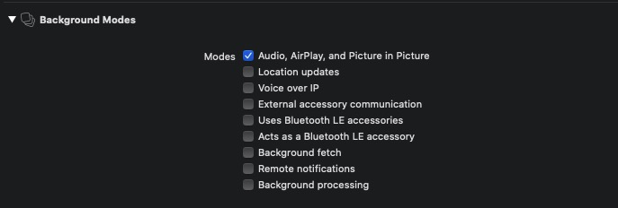
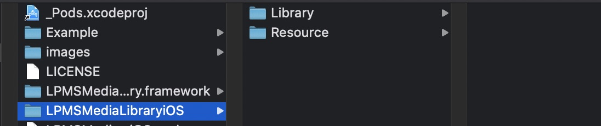

# LPMSMediaLibraryiOS

[English](README.md) | [中文](README_zh.md)

LPMSMediaLibrary是Linkplay iPhone媒体库接入方案的app端SDK；通过它，您可以快速的将iPhone媒体库的音乐播放到您的产品里。

LPMSMediaLibrary主要解决了两方面的问题：

- 展示iPhone媒体库中的音乐

- 播放iPhone媒体库中的音乐到您的产品里

## 文档

你可以在这里找到更多[文档](https://linkplayapp.github.io/linkplay_sdk_doc/zh-hans/introduction.html) 。

## 如何开始

- [下载 LPMSMediaLibraryiOS](https://github.com/linkplayapp/LPMSMediaLibraryiOS/archive/master.zip) 并且导入SDK到你的工程中

## SDK Demo
###  1. 使用 CocoaPods 安装SDK的demo
- [LPMusicKitPodsDemo](https://github.com/linkplayapp/LPMusicKitPodsDemo)

###  2. 手动导入SDK的demo
- [LPMusicKitDemo](https://github.com/linkplayapp/LPMusicKitDemo)

## 需求

- iOS >= 10.0

## 安装

###  1. 使用 CocoaPods 安装

LPMSMediaLibraryiOS 可以通过 [CocoaPods](https://cocoapods.org) 安装. 将下面的代码添加到您的pod文件里即可：

```ruby
platform :ios, '10.0'
# 私有的源，安装数据处理的SDK
source 'https://github.com/linkplayapp/LPSpecsiOS.git'
# 你本地配置CocosPods的源的地址
source 'https://github.com/CocoaPods/Specs.git'

target 'your_target_name' do

   pod "LPMSMediaLibraryiOS", :git => "https://github.com/linkplayapp/LPMSMediaLibraryiOS.git"

end
```

然后在项目根目录下执行 `pod update` 命令进行集成。

_CocoaPods 的使用请参考：[CocoaPods Guides](https://guides.cocoapods.org/)_
_CocoaPods 建议更新至最新版本_

- Info.plist 添加访问媒体库的key：NSAppleMusicUsageDescription
- 申请长后台权限


### 2. 手动配置项目

#### Step 1: 下载 LPMSMediaLibraryiOS
- [下载 LPMSMediaLibraryiOS](https://github.com/linkplayapp/LPMSMediaLibraryiOS/archive/master.zip)

#### Step 2: 导入SDK
- 导入 LPMSMediaLibrary.framework，依赖的SDK:[LPMusicKitiOS](https://github.com/linkplayapp/LPMusicKitiOS)、[LPMDPKitiOS](https://github.com/linkplayapp/LPMDPKitiOS)

#### Step 3: 导入依赖库
- 导入LPMSMediaLibraryiOS/Resource 和 LPMSMediaLibraryiOS/Library 中的文件


#### Step 4: Xcode 工程设置

- Info.plist 添加访问媒体库的key：NSAppleMusicUsageDescription
- 申请长后台权限


>  因为播放本地音乐的需要，修改了LPMSMediaLibraryiOS/Library/CocoaHTTP/HTTPConnection 文件，添加了HTTPConnection+iTunes 类，且在GCDAsyncSocket 类中也添加了代码, 如果本身有导入这两个三方库，需要注意修改下

```
// HTTPConnection
if ([self respondsToSelector:@selector(prepareITunesFile:)]) {
    [self prepareITunesFile:uri];
}

```
```
// GCDAsyncSocket
// - (void)doWriteData
Class class = NSClassFromString(@"LPMSLibraryManager");
...

```


## 作者

LinkPlay, ios_team@linkplay.com
